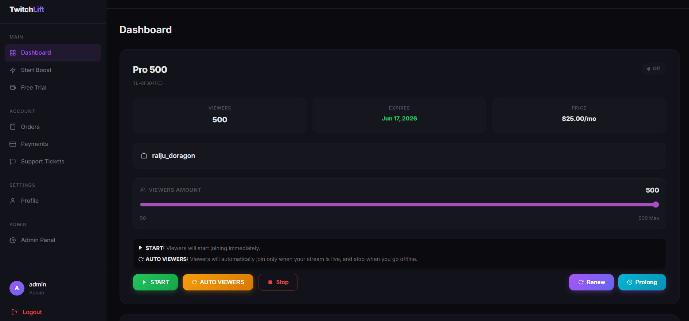

<h1 align="center">TwitchLift — #1 Twitch View Bot & Viewer Bot Service</h1>

<p align="center">
  <strong>The most advanced, undetectable Twitch viewer bot. Boost your Twitch live viewers instantly with zero downloads, zero proxies, and fully automated delivery.</strong>
</p>

<p align="center">
  <a href="https://twitchlift.com"></a>
  <a href="https://twitchlift.com/register"></a>
  <a href="https://twitchlift.com/pricing"></a>
</p>

<p align="center">
  
  
  
  
  
  
</p>

---

## 🚀 What is TwitchLift?

**TwitchLift** is the **#1 Twitch view bot** and **Twitch viewer bot service** trusted by thousands of streamers worldwide. Whether you're looking to **buy Twitch viewers**, boost your live stream visibility, or grow your channel organically through increased exposure, TwitchLift provides the most reliable and undetectable viewer bot solution on the market.

### Why Streamers Choose TwitchLift as Their Twitch View Bot

- 🎯 **Undetectable** — Our Twitch viewer bot uses advanced anti-detection technology that makes viewers appear as real, organic traffic
- ⚡ **Instant Delivery** — Viewers start appearing on your stream within seconds of activation
- 🔒 **Zero Downloads** — No software to install, no proxies to configure. Everything runs in the cloud
- 🤖 **Fully Automated** — Set it and forget it. Our view bot runs 24/7 with auto-restart capabilities
- 💰 **Starting at $5/mo** — The most affordable Twitch viewer bot service on the market
- 🎁 **Free Trial** — Try our Twitch view bot free with 500 viewers for 10 minutes, no credit card required
- 🪙 **Crypto Payments** — Pay with Bitcoin, Ethereum, USDT, and 70+ cryptocurrencies
- 📊 **Real-Time Dashboard** — Monitor your viewer count, stream status, and campaign analytics live

---

## 📋 Table of Contents

- [Features](#-features)
- [How It Works](#-how-it-works)
- [Pricing](#-pricing-plans)
- [Free Trial](#-free-trial)
- [Comparison](#-twitchlift-vs-other-twitch-view-bots)
- [FAQ](#-frequently-asked-questions)
- [Use Cases](#-use-cases)
- [Screenshots](#-screenshots)
- [Support](#-support)
- [Legal](#-legal-disclaimer)

---

## ✨ Features

### Core Twitch View Bot Features

| Feature | Description |
|---------|-------------|
| **Instant Viewer Delivery** | Viewers appear on your Twitch stream within seconds of starting a campaign |
| **Undetectable Technology** | Advanced anti-detection ensures your Twitch view bot traffic looks 100% organic |
| **No Proxy Required** | Unlike other Twitch viewer bots, TwitchLift requires zero proxy configuration |
| **No Downloads** | Fully cloud-based Twitch view bot — no software installation needed |
| **Automated Campaigns** | Set up your viewer bot campaign once and it runs automatically 24/7 |
| **Custom Viewer Count** | Choose exact viewer counts in increments of 50, up to 100,000 viewers |
| **Auto-Restart** | If your stream goes offline and comes back, viewers automatically reconnect |
| **Multi-Channel Support** | Run the view bot on multiple Twitch channels simultaneously |

### Advanced Features

| Feature | Description |
|---------|-------------|
| **Real-Time Dashboard** | Live monitoring of viewer counts, stream status, and campaign health |
| **Viewer Stability Engine** | Proprietary technology maintains consistent viewer counts without drops |
| **Smart Ramp-Up** | Viewers join gradually to simulate natural growth patterns |
| **GeoIP Distribution** | Viewer traffic distributed across multiple geographic regions |
| **WebSocket Protocol** | Uses Twitch's native WebSocket protocol for undetectable connections |
| **24/7 Support** | Round-the-clock support via tickets and Telegram |
| **Crypto Payments** | Bitcoin, Ethereum, USDT, Litecoin, and 70+ altcoins accepted |
| **Multilingual** | Dashboard available in English and Russian |

---

## 🔧 How It Works

Using TwitchLift's Twitch view bot is simple — no technical knowledge required:

```
Step 1: Create Account     →  Sign up at twitchlift.com (30 seconds)
Step 2: Choose Plan        →  Select from 21 packages ($5/mo to enterprise)
Step 3: Enter Channel      →  Type your Twitch channel name
Step 4: Activate           →  Click "Start" and viewers appear in seconds
Step 5: Monitor            →  Track everything from your real-time dashboard
```


## 💎 Pricing Plans

TwitchLift offers the **cheapest Twitch viewer bot** pricing on the market with 21 packages to choose from:

### Popular Plans

| Plan | Viewers | Price | Best For |
|------|---------|-------|----------|
| **Starter** | 100 | $5/mo | New streamers testing the waters |
| **Growth** | 500 | $15/mo | Small streamers building momentum |
| **Pro** | 1,000 | $25/mo | Established streamers seeking visibility |
| **Business** | 5,000 | $80/mo | Professional streamers and esports teams |
| **Enterprise** | 10,000+ | $150+/mo | Large-scale operations and agencies |
| **Ultimate** | 100,000 | Custom | Maximum viewer capacity |

> 💡 **All plans include:** Free trial, instant activation, undetectable viewers, real-time dashboard, crypto payments, and 24/7 support.

### 👉 [View All 21 Plans →](https://twitchlift.com/pricing)

---

## 🎁 Free Trial

Try our **Twitch view bot free** before you buy:

- **500 free viewers** for 10 minutes
- No credit card required
- No downloads needed
- Instant activation
- Experience the full power of our viewer bot

### 👉 [Start Free Trial →](https://twitchlift.com/register)

---

## 📊 TwitchLift vs Other Twitch View Bots

How does TwitchLift compare to other Twitch viewer bot services?

| Feature | TwitchLift | Other View Bots |
|---------|:----------:|:---------------:|
| **Undetectable** | ✅ Yes | ❌ Often detected |
| **No Downloads** | ✅ Cloud-based | ❌ Requires software |
| **No Proxies Needed** | ✅ Built-in | ❌ BYO proxies |
| **Instant Delivery** | ✅ Seconds | ⚠️ Minutes to hours |
| **Free Trial** | ✅ 500 viewers | ❌ Most don't offer |
| **Crypto Payments** | ✅ 70+ coins | ⚠️ Limited options |
| **Max Viewers** | ✅ 100,000 | ⚠️ Usually < 10K |
| **Auto-Restart** | ✅ Included | ❌ Manual restart |
| **Starting Price** | ✅ $5/mo | ⚠️ $10-30/mo |
| **24/7 Support** | ✅ Always | ⚠️ Business hours |
| **Viewer Stability** | ✅ 99.9% | ⚠️ Frequent drops |
| **Dashboard** | ✅ Real-time | ❌ Basic or none |

---

## ❓ Frequently Asked Questions

### What is a Twitch view bot?

A **Twitch view bot** (also called a Twitch viewer bot) is a service that sends automated viewers to your Twitch live stream. These viewers increase your viewer count, helping your stream rank higher in Twitch's directory and attract more organic viewers. TwitchLift is the most advanced and undetectable Twitch view bot available.

### Is TwitchLift's Twitch viewer bot safe?

Yes. TwitchLift uses advanced anti-detection technology that makes our viewer bot traffic appear as real, organic viewers. Our service has a **0% detection rate** and has been trusted by 2,400+ streamers with 18,000+ successful boosts delivered.

### How does the Twitch view bot work?

TwitchLift's view bot connects to your Twitch stream using the same WebSocket protocol that real Twitch viewers use. Each connection mimics authentic viewer behavior, including watch time patterns and connection metadata, making it virtually indistinguishable from real viewers.

### Do I need to download anything?

**No.** TwitchLift is a fully cloud-based Twitch viewer bot. There's no software to download, no proxies to configure, and no technical setup required. Everything runs from your web browser through our dashboard.

### Can I try the Twitch view bot for free?

Yes! TwitchLift offers a **free trial with 500 viewers** for 10 minutes. No credit card required. Simply create an account and start your trial immediately.

### How many viewers can I get?

TwitchLift supports **up to 100,000 concurrent viewers** on a single stream. You can customize your exact viewer count in increments of 50.

### What payment methods are accepted?

We accept **cryptocurrency payments** including Bitcoin (BTC), Ethereum (ETH), USDT, Litecoin (LTC), and 70+ other cryptocurrencies through our secure payment processor.

### Will viewers drop or fluctuate?

TwitchLift uses a proprietary **Viewer Stability Engine** that maintains consistent viewer counts. Our service achieves 99.9% uptime with minimal fluctuation, unlike cheaper view bots that experience frequent drops.

### Can I use the view bot on multiple channels?

Yes. You can run TwitchLift's viewer bot on **multiple Twitch channels** simultaneously. Each channel requires its own active plan.

### How quickly do viewers appear?

Viewers begin appearing on your stream **within seconds** of activating your campaign. Full viewer count is typically reached within 1-2 minutes.

---

## 🎯 Use Cases

### For New Streamers
- Get discovered in Twitch's directory by boosting your viewer count above the minimum threshold
- Attract organic viewers who are more likely to join streams with existing audiences
- Build social proof and credibility from day one

### For Growing Streamers
- Maintain consistent viewer numbers during off-peak hours
- Boost visibility during special events, tournaments, or game launches
- Reach Twitch Partner/Affiliate milestones faster with higher average viewer counts

### For Professional Streamers & Esports Teams
- Ensure high viewer counts during sponsored streams and brand deals
- Maintain competitive positioning in game directories
- Scale viewer numbers for major events and tournaments

### For Agencies & Networks
- Manage multiple streamer accounts from a single dashboard
- Provide viewer boost services to your roster of content creators
- White-label viewer management for your streaming network

---

## 📸 Screenshots

<p align="center">
  
  <br/>
  <em>Real-time dashboard for managing your Twitch viewer bot campaigns</em>
</p>

---

## 🛡️ Security & Privacy

- **No account credentials required** — We never ask for your Twitch password
- **Encrypted connections** — All data transmitted over HTTPS/TLS
- **Privacy-first** — We don't store or share your streaming data
- **Anonymous payments** — Pay with cryptocurrency for complete privacy
- **No logs policy** — Campaign data is automatically purged after expiration

---

## 📞 Support

Need help with our Twitch view bot? We're here 24/7:

| Channel | Link |
|---------|------|
| **Website** | [twitchlift.com](https://twitchlift.com) |
| **Support Tickets** | [twitchlift.com/tickets](https://twitchlift.com/tickets) |
| **Telegram** | [@twitchlift](https://t.me/twitchlift) |
| **Email** | support@twitchlift.com |

---

## ⭐ Star This Repo

If you find TwitchLift useful, please **star this repository** ⭐ to help other streamers discover the best Twitch view bot service!

---

## 📜 Legal Disclaimer

TwitchLift is a third-party service and is not affiliated with, endorsed by, or sponsored by Twitch Interactive, Inc. or Amazon.com, Inc. Use of viewer bot services may violate Twitch's Terms of Service. Users assume all risks associated with the use of this service. TwitchLift provides this service as-is and makes no guarantees regarding account safety.

---

## 🏷️ Keywords

`twitch view bot` · `twitch viewer bot` · `view bot` · `viewer bot` · `twitch bot` · `buy twitch viewers` · `twitch viewers` · `twitch live viewers` · `twitch viewer boost` · `twitch view bot free` · `free twitch viewers` · `twitch viewbot` · `cheap twitch viewers` · `twitch viewer bot undetectable` · `twitch stream bot` · `twitch bot viewers` · `best twitch viewer bot` · `twitch viewer bot free trial` · `buy twitch live viewers` · `twitch booster` · `twitch view bot 2026` · `twitch viewer service`

---

<p align="center">
  <strong>🚀 <a href="https://twitchlift.com">Get Started with TwitchLift Today</a> 🚀</strong>
  <br/>
  <sub>The #1 Twitch View Bot — Trusted by 2,400+ Streamers Worldwide</sub>
</p>
